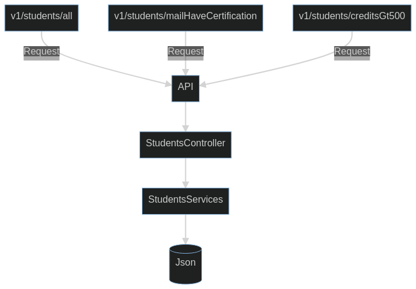
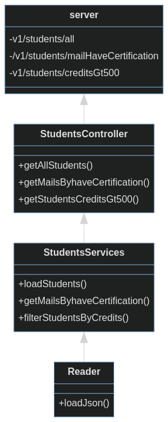

# VisualThinkingAPI
Practica de API en LaunchX propuesta por el mission commander *Carlo Gilmar*  :pushpin::pushpin::pushpin:

## Requisitos
- Node
- Gestor de paquetes npm

## Dependencias de node
- **Jest**    --> Con ella realizamos nuestras pruebas unitarías.
- **Linter**  --> Nos ayuda a organizar de una forma más legible el código.
- **Express** --> Módulo necesaría con la cual se crea el servidor.

## Estructura de API

## Estructura de clases y metodos

## Instalando proyecto(Linux Fedora 33) :computer::computer::computer:

*Clonar proyecto* :heavy_check_mark:
> git clone `https://github.com/LuisAngelFnz/VisualThinkingAPI.git` CopiaVisualThinkingAPI

*Instalar dependencias* :heavy_check_mark:
> cd CopiaVisualThinkingAPI/

> npm install --save-dev jest@26.0.0

> npm install express --save-dev

> npm install eslint --save-dev

## Correr Servidor :rocket::rocket::rocket:
> npm run server

## Consultando API :round_pushpin::round_pushpin::round_pushpin:
Todas peticiones realizadas al API retornan la respuesta en formato json,\
para realizar las peticiones puede utilizar las siguientes rutas:

Obtiene todos los estudiantes
> `http://localhost:3000/v1/students/all`\
   Response:\
      > {"students":["Lista de objetos de todos los estudiantes"]}

Obtiene los correos electronícos de estudiantes con HaveCertification
> `http://localhost:3000/v1/students/mailHaveCertification`\
   Response:\
      > {"studentsMail":["Lista de correos electronícos"]}

Obtiene los estudiantes con credits mayor a 500
> `http://localhost:3000/v1/students/creditsGt500`\
   Response:\
       > {"students":["Lista de objetos de los estudiantes"]}

# Muchas Gracias
